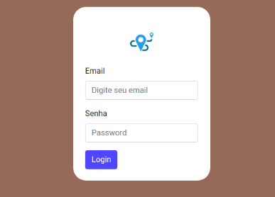
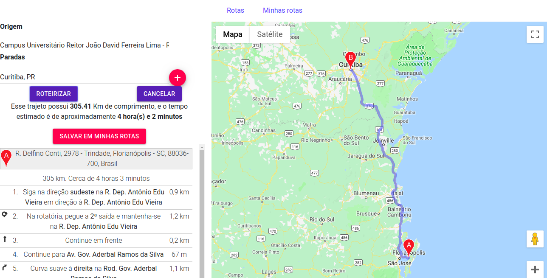

# route-script-challenge
  This is a project to help the route planning. For example deliveries, and you can save the routes and see after 

  
  

# Setting up
Go to **src/config/settings.js** and set the file **with you configuration**.

# To run:

In project directory run the followings commands to install the dependencies: 
`npm install -D`
`npm install `

And this to run the app:
`npm start`

  

And see on **localhost:4545**

# Requirements

Nodejs 8.10 or >
